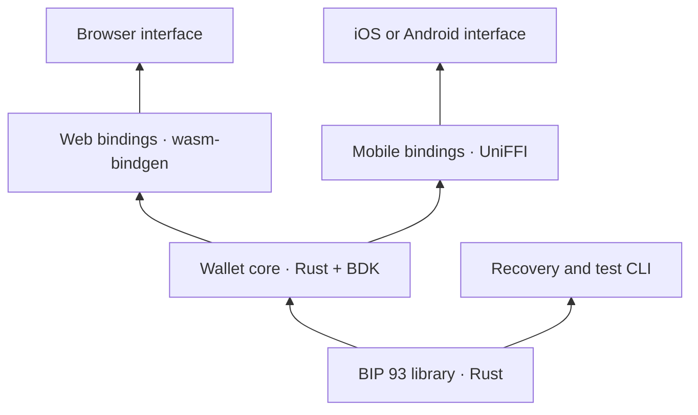

# Rust library and wallet plan

Recommendation recorded 2026-09-04. The first build milestone is now implemented in the three Rust crates; [validation.md](validation.md) records the evidence. Native mobile bindings, encrypted signing-key storage, and an end-user application remain future work. The component names below are local crates, not published packages.

## Why start with a library?

Backup validation and recovery should behave identically on every platform and be testable without an interface. A small reusable core also lets another wallet adopt our BIP 93 support, or a recovery tool continue working independently of our app.

Build the library around one working wallet journey. The first success is recovering the same wallet from its shares, followed by receiving and spending test bitcoin. This gives the API a concrete consumer before it grows.

## Proposed boundaries

Arrows show which component is used by the next layer. Platform adapters supply randomness, persistence, chain data, and protected storage; the backup library has no networking, database, or UI dependency.

| Proposed component | Owns | Leaves to other components |
| --- | --- | --- |
| `codex32-core` | Seed encoding, parsing, checksums, share generation and recovery, typed errors | Addresses, balances, transactions, storage |
| `codex32-wallet` | Wallet lifecycle, descriptor policy, receive addresses, transaction construction/signing, recovery identity checks | UI, platform storage and network transport |
| Thin bindings | Convert supported arguments, results, and errors between languages | Cryptographic rules and wallet policy |

No package publication or registry name availability is assumed.

## Reuse assessment

The implementation uses [bech32 0.12.0](https://docs.rs/bech32/0.12.0/bech32/), the `rust-bitcoin/rust-bech32` crate, for the generic BCH checksum engine and finite-field primitives. The local `Checksum` implementations provide BIP 93's constants and checksum lengths; the remaining layer enforces BIP 93 headers, case, seed lengths, padding, and share rules. Secret payload interpolation uses a small fixed-operation multiplication routine instead of secret-indexed multiplication tables, checked against `bech32` for all 1,024 input pairs. This is broadly the architecture proposed by the upstream Rust reference's planned rewrite. It does not claim end-to-end constant-time behavior.

The [original Rust reference](https://github.com/apoelstra/rust-codex32) is a useful implementation to inspect and compare against. Its README still describes the code as rough and discusses a future rewrite around bech32. Assess the actual code and tests before choosing to depend on it, extend it, or implement the missing layer ourselves. Reusing code does not establish its security.

Use [BDK's wallet library](https://docs.rs/bdk_wallet/3.1.0/bdk_wallet/) for descriptor-based wallet operations. It can derive addresses, track owned outputs from supplied chain data, and construct and sign transactions. Keep our BIP 93 crate independent of BDK so it remains usable elsewhere.

BDK already has [web bindings](https://github.com/bitcoindevkit/bdk-wasm) and [Swift/Kotlin bindings](https://github.com/bitcoindevkit/bdk-ffi). Those are useful precedents and possible integrations; they do not automatically expose our custom backup API. Validate version compatibility before combining bindings. A thin binding around our own Rust wallet object can keep recovered secrets out of intermediate application code.

## First library scope

Target the BIP 93 specification and pin its source revision alongside the conformance fixtures; it is currently marked Draft. Support direct seeds and shares, both checksum lengths, valid seed sizes, strict header and case handling, and recovery from a valid threshold set. Preserve the standard's payload-padding rules and reject malformed combinations. [BIP 93](https://github.com/bitcoin/bips/blob/master/bip-0093.mediawiki)

The initial API should let a caller validate a share, encode a seed, generate a backup set using a supplied cryptographic random source, and recover a seed. Keep secret-bearing values separate from displayable metadata. Avoid implicit logging, serialization, or debug output of secrets. Random-source failure must return an error.

Error detection belongs in the first milestone. Error correction is a separate feature with explicit guarantees, tests, and user confirmation; do not silently change input or claim correction support before it is implemented.

## Native and web reuse

[wasm-bindgen](https://wasm-bindgen.github.io/wasm-bindgen/) provides a Rust-to-JavaScript boundary for a browser build. [UniFFI](https://mozilla.github.io/uniffi-rs/latest/) provides bindings for languages including Swift and Kotlin. The core logic can be shared; storage, networking, lifecycle, and interface code still need platform-specific integration.

Browser storage cannot use the native filesystem backend directly, and the chosen chain client must support browser networking. BDK's [WASM documentation](https://github.com/bitcoindevkit/bdk-wasm) calls out these constraints. Prove a small native and browser recovery example early, then build one application interface first.

Native mobile is the recommended first application for real funds. Evaluate [Apple Keychain](https://developer.apple.com/documentation/security/keychain-services) and [Android Keystore](https://developer.android.com/privacy-and-security/keystore) integration for protected storage. Do not assume a phone's secure hardware can directly hold and sign with every Bitcoin key type; protecting the key used to encrypt local wallet material is a separate design.

WASM is a portability mechanism, not protection against a malicious page that controls its host environment. The [WebAssembly security model](https://webassembly.org/docs/security/) defines its sandbox within that environment. A production web wallet needs an explicit decision about code delivery, persistent secret storage, and the browser threat model.

## Keep the wallet simple

Propose one single-signature account and one standard address policy for the first wallet. Present create, restore, receive, send, and backup. Offer two-of-three as the initial backup preset; keep other supported thresholds out of the main flow. Preserve the wallet's derivation and network metadata for recovery.

The two-of-three requirement applies to restoring the backup. An unlocked wallet can spend without collecting the shares again, so a compromised phone remains a spending risk. Explain that once during backup setup rather than adding share handling to every payment.

Retain the manuscript visual direction through typography, borders, share cards, and occasional illustrations. Secret characters, amounts, destinations, and transaction fees need clear, conventional presentation.

## First build milestone

1. Choose and pin dependencies after comparing the candidate implementations with official public fixtures.
2. Implement the small backup API with conformance, round-trip, malformed-input, and threshold tests, including an independent recovery comparison.
3. Run the same recovery fixtures natively and in WASM; verify equivalent results and errors across bindings.
4. Add a minimal BDK integration that creates a wallet, generates shares, restores a fresh instance, and compares multiple receiving and change addresses.
5. Complete a local regtest receive-and-spend cycle, including persistence and reload, before building the first full interface.

This milestone establishes a working technical foundation. It is not a security audit or a real-funds release.
