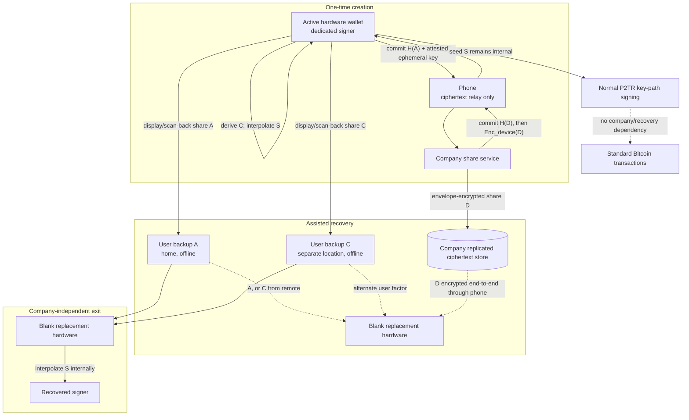

# Codex32 Bitcoin Recovery System

**Research status:** 2026-09-04. **Decision:** build a fixed 2-of-3 BIP93 backup system only with a hardware-wallet partner that can reconstruct the seed internally. Put one share at the user's home, one in a separate user-controlled location, and one in the company's recovery service. Use independent hardware and service contributions with a commit-before-reveal ceremony. Keep the company out of ordinary spending. Do not put shares or seed material on Bitcoin, phones, browsers, or general-purpose computers. Do not make a TEE an MVP dependency.

This report separates properties proved by BIP93 or the prototype from operational assumptions. BIP93 is mandatory throughout. It is still a **Draft Informational BIP**, its reference repository calls itself far from production-ready, and the implementation in this repository is explicitly unaudited. Nothing here is approval to use the prototype with real funds.

## Codex32 for the product

### What it is

[BIP93](https://github.com/bitcoin/bips/blob/master/bip-0093.mediawiki) defines Codex32: a checksummed Bech32-alphabet representation of a 16-to-64-byte BIP32 master seed, with optional Shamir secret sharing over $GF(32)$. A secret can be left as one `S` string, or represented by up to 31 shares with a threshold from 2 through 9. Exactly the declared threshold of compatible, distinct-index shares recovers the secret; fewer than the threshold reveal no information about it under the stated random-generation assumptions.

A standard string is:

```text
MS1 | k | identifier | index | payload | checksum
 3     1       4          1      variable      13 characters
```

- `MS1` is fixed.
- `k` is `2`–`9` for a shared secret, or conventionally `0` for an unshared `S` secret.
- The identifier is four Bech32 characters: 20 public bits for human disambiguation, not authentication.
- The index is one Bech32 character. `S` denotes the recovered/unshared secret. The other 31 characters are available as share indices.
- A 128-bit seed produces a 48-character string. A 256-bit seed produces a 74-character string. BIP93's long form covers seeds through 64 bytes with a 15-character checksum.
- A string must be entirely upper- or lowercase. Uppercase is recommended for handwriting and is more compact in QR alphanumeric mode.

### Secret generation and entropy

BIP32 accepts 128–512 seed bits and advises 256 bits. It computes the master extended key as `HMAC-SHA512(key="Bitcoin seed", data=S)`; see [BIP32, Master key generation](https://github.com/bitcoin/bips/blob/master/bip-0032.mediawiki#master-key-generation). For this product, fix `S` at 256 bits. This gives margin against imperfect entropy sources, avoids a consumer-facing security setting, and follows BIP32's advice. The cost is 74 characters per physical share instead of 48 for 128 bits.

There are two conforming ways to generate a shared fresh wallet:

1. Generate seed `S`, encode it at index `S`, add `k-1` random compatible shares, and interpolate the desired backup shares.
2. Generate `k` independently random initial shares with compatible metadata and distinct indices. Those points define a degree-`k-1` polynomial; evaluating it at index `S` produces a fresh seed. No party has to choose the seed first.

For a 256-bit wallet, each initial share needs $\lceil256/5\rceil=52$ uniformly random Bech32 symbols, or 260 sampled bits. The decoder discards the final four padding bits, so the resulting BIP32 seed has 256 bits. For 128 bits the corresponding values are 26 symbols and 130 sampled bits.

Use a CSPRNG that fails closed. On Linux, [`getrandom(2)`](https://man7.org/linux/man-pages/man2/getrandom.2.html) without `GRND_RANDOM` blocks until the kernel pool is initialized, and requests of at most 256 bytes are the preferred mode. Hardware sources require an assessed entropy source, conditioning, health tests, and a DRBG design; [NIST SP 800-90B](https://doi.org/10.6028/NIST.SP.800-90B) is relevant source guidance, not proof that a particular wallet is sound. Current Trezor firmware combines 32 bytes of internal device randomness and host-provided external entropy with SHA-256; current Jade code mixes its ESP RNG, state, counters, environmental readings, and optional external entropy. These are useful patterns, not endorsements of either device for Codex32.

### Arbitrary thresholds and independently generated shares

For each payload symbol, recovery is Lagrange interpolation in $GF(32)$. With distinct input indices $x_i$, the recovered symbol at `S` is

$$S=\sum_{i=1}^{k}\lambda_iY_i,$$

where every $\lambda_i$ is nonzero. Multiplication by a nonzero field element is a permutation. Therefore, if at least one $Y_h$ is uniform, independent, and hidden until every other contribution is fixed, then $\lambda_hY_h$ is uniform, and XOR/addition with all fixed terms leaves `S` uniform. The same argument applies independently to every payload symbol. This is the precise value of distributed generation: one honest high-quality contributor makes the result unpredictable even if all other contributions are fixed or have failed randomness.

Important limits:

- The guarantee is conditional on completion, compatible metadata, a correct combiner, and at least one truly uniform hidden contribution.
- It protects against RNG failure or a contributor trying to predetermine the seed. It does not stop the final hardware signer from learning the seed, using a different seed, or exfiltrating keys.
- A contributor that sees the other inputs before choosing its own can force any desired secret, because its nonzero Lagrange coefficient is invertible. BIP93 itself is not an authenticated distributed-key-generation protocol.
- Every contribution must therefore be bound before any contribution is revealed. A production commitment must cover protocol/version, ceremony nonce, expiry, `k`, identifier, index, payload, contributor role, endpoint key, and transcript hash. SHA-256 is computationally hiding here only because the payload is already high entropy. Commit/reveal cannot prevent abort; it converts adaptive bias into detectable denial of service.
- In the recommended one-sided reveal, the company receives only a commitment to the hardware share. The company's share is then encrypted to the committed hardware endpoint. The company never receives the hardware payload or either user backup.

### What one share discloses

One valid share discloses its threshold, 20-bit identifier, share index, seed length, and the fact that it is probably wallet backup material. It correlates every share with the same identifier. It does not disclose the seed under ideal Shamir generation, and the checksum adds no secret information.

The identifier is not a wallet fingerprint or authenticator. Twenty bits collide naturally at scale and are easy for an adversary to match deliberately. Generate it randomly, use it only to prevent accidental mixing, and never use it as a database primary key or derive it from an xpub. Keep a separate authenticated public wallet identity: preferably a SHA-256 digest of canonical external and internal descriptors, with the descriptors themselves available as watch-only recovery data. A four-byte BIP32 master fingerprint alone is too short to authenticate a high-value recovery.

### Checksums, verification, and manual use

The 13-character BCH checksum contains no secret information. BIP93 guarantees detection of any error affecting at most eight characters and gives less than a $3\times10^{-20}$ chance of missing larger random corruption. It is designed to correct up to four substitutions, eight erasures, or thirteen contiguous erasures. A wallet claiming error-correcting-wallet support must follow the [Codex32 wallet developer guide](https://github.com/BlockstreamResearch/codex32/blob/master/docs/wallets.md): show candidates, highlight changes, and require the user to confirm that the corrected string exactly matches the backup. It must never silently continue.

The checksum is **not a MAC**. An attacker can construct a different valid share or an entirely different valid share set. After interpolation, the device must derive the wallet's public descriptors and compare their strong, independently stored identity before installing the seed. A checksum-valid result with the wrong descriptor is a hard abort.

The [paper-computer reference project](https://github.com/BlockstreamResearch/codex32) and [Secret Codex32 manual](https://secretcodex32.com/) provide volvelles and worksheets for random-share generation, interpolation, checksum computation, and checksum checking without electronics. This is valuable for long-term integrity audits. It is not consumer-simple: the manual's FAQ estimates an experienced 128-bit 2-of-3 setup at about 2 hours 15 minutes, with recovery around 10 minutes and a checksum around 40 minutes. Dice input must use the worksheet's unbiased extraction; direct modulo mapping of die rolls is unsafe. The consumer product should make manual recovery an interoperability backstop, not its normal ceremony.

### Mapping into BIP32

The recovered payload bytes are the BIP32 seed `S` directly. Do not apply BIP39's PBKDF2, a password KDF, or another hash first. [BIP39](https://github.com/bitcoin/bips/blob/master/bip-0039.mediawiki) maps mnemonic text and optional passphrase through PBKDF2-HMAC-SHA512 with 2048 iterations to a 64-byte BIP32 seed. That one-way mapping means an arbitrary Codex32/BIP32 seed generally cannot be represented by BIP39 words. Do not offer “convert to 24 words”; create a new wallet and sweep instead.

BIP93 deliberately omits passphrases and key hardening to remain manually computable. Do not bolt a passphrase onto this product and call the result Codex32-compatible.

### Support reality as of 2026-09-04

No released commercial hardware wallet was verified to natively generate, interpolate, or recover a threshold BIP93 share set:

- [Jade issue #129](https://github.com/Blockstream/Jade/issues/129) remains open.
- [SeedSigner issue #689](https://github.com/SeedSigner/seedsigner/issues/689) remains open; its documented QR seed formats are BIP39/SeedQR, not BIP93.
- [Coldcard's documented import limits](https://github.com/Coldcard/firmware/blob/master/docs/limitations.md) cover BIP39 and root XPRV; its QR autodetection list does not include BIP93.
- Current [Trezor firmware reset code](https://github.com/trezor/trezor-firmware/blob/main/core/src/apps/management/reset_device/__init__.py) exposes BIP39 and SLIP39 paths, not Codex32.
- Sparrow [2.4.0](https://github.com/sparrowwallet/sparrow/releases/tag/2.4.0) added a Codex32 importer, but its current [`Bip93.java`](https://github.com/sparrowwallet/sparrow/blob/master/src/main/java/com/sparrowwallet/sparrow/io/Bip93.java) explicitly says only a single share is supported. That imports a recovered `S` secret into a software wallet; it does not provide hardware-confined threshold recovery.
- [Bails](https://github.com/BenWestgate/Bails) and newer [Python reference code](https://github.com/BenWestgate/python-codex32) provide useful software evidence, but the Python project itself says to verify carefully before real-fund use. The older [rust-codex32](https://github.com/apoelstra/rust-codex32) describes its state as rough and slated for rewrite.

This support gap is the product's gating dependency. A phone- or laptop-only substitute would violate the stated seed-confinement requirement rather than complete the product.

## Architectures investigated

| Architecture | Recovery topology | Ordinary spending | Company power | User exit | Complexity | Decision |
|---|---|---|---|---|---|---|
| **Distributed 2-of-3 user/user/company** | `A+C`, `A+D`, or `C+D`; seed reconstructed on replacement signer | One standard hardware signer | Holds only `D`; cannot recover alone | `A+C` | Medium | **Recommended target** |
| Device-local 2-of-3 user/user/company | Device makes seed and all shares; same recovery topology | One standard hardware signer | Holds only one share | `A+C` | Low | Acceptable fallback/pilot; weaker RNG independence |
| 2-of-3 plus Nitro enclave | Same shares; company share generated, sealed, and released in an attested enclave | Same | Company app/root separated from plaintext share if correctly deployed | `A+C` | High | Possible later hardening, not MVP |
| 3-of-5, three user plus company plus independent custodian | Any three shares | One hardware signer | Company plus one stolen user share is still short | Three user shares can exit | High user burden | High-value tier only after field testing |
| All-user 2-of-3; company coaches only | Any two user shares | One hardware signer | No factor and no recovery leverage | Yes | Low service value | Sound self-custody baseline, weak assisted-recovery product |
| 2-of-2 user/company | Both shares | One hardware signer | Cannot recover alone | **No** | Low | Reject: company failure can strand user |
| Phone/user/company 2-of-3 | Phone share plus user or company | One hardware signer | Below threshold | Maybe | Low | Reject: general-purpose/mobile/cloud exposure |
| 2-of-3 on-chain multisig | Two independent signing keys, optionally company as third signer | Two signers per spend or company participation | Visible policy; possible transaction participation | Depends on key allocation | High | Separate high-security product, not a backup improvement |
| Encrypted or plaintext on-chain recovery package | Share/package published in Bitcoin | Unchanged | Depends on encryption key | Superficial | High hidden risk | Reject |
| Custom recovery-only gadget | Gadget reconstructs, then exports to a signer | Unchanged | Below threshold | Yes | Very high | Reject; use a replacement signer so seed never transfers |

### Strongest candidates

1. **Distributed 2-of-3** is the best balance. Two independently controlled user locations give permanent company exit. Either user share plus the company gives assisted recovery. Every single share can be lost. Distributed initial shares remove a single-RNG dependency at one extra setup round trip.
2. **Device-local 2-of-3** has the same custody topology with less ceremony. It is the contingency if a hardware partner cannot safely implement the contribution transcript. It relies entirely on the signer's RNG at creation.
3. **2-of-3 plus an attested enclave** can reduce how often company operators or a compromised host see `D`, but `D` is already below threshold. It introduces AWS, KMS policy, image-build, upgrade, rollback, availability, and side-channel dependencies. The security gain is narrower than the operational cost.
4. **3-of-5** materially improves resistance to the company colluding with one stolen user share. It also requires three independent user locations for exit and two user factors for company-assisted recovery. That is not a default consumer experience.
5. **All-user 2-of-3** remains the clean fallback for customers who want no company-held factor. It does not deliver the key assisted-recovery value proposition.

### Additional first-principles findings

- Copying an encrypted company share onto both user backups does not create free resilience. If either backup also carries the decryption key, one user object effectively contains two threshold shares. If the key is elsewhere, the design has merely invented another backup.
- A phone-held share is still a share. Secure-enclave APIs, OS backups, screenshots, accessibility layers, and account restoration create a much larger and less inspectable boundary than an offline card or dedicated signer.
- A recovery-only hardware product is inferior to making the replacement hardware wallet do reconstruction. Otherwise the recovered seed must cross a device boundary.
- Multisig is the honest answer if “no single active component can spend” is literal. It changes every spend, descriptor backup, fee/transaction workflow, and succession plan. Codex32 threshold backups solve a different problem: compromise and loss of backup material.

## Experimental discoveries

| Experiment or analysis | Result | Product consequence |
|---|---|---|
| Published BIP93 `NAME` vector, shares A and C | Derived D exactly; A+C, A+D, and C+D recover the published seed and BIP32 xprv | Independent interoperability oracle is viable |
| Two separately seeded deterministic CSPRNG contributors at indices A and D | Generated valid compatible 256-bit initial shares and derived C | A fresh seed can emerge without first existing outside the combiner |
| Exhaustive 2-of-3 recovery matrix | All three pairs recover byte-identical seed and xprv | Any one share may be unavailable |
| Component trace | Only dedicated hardware ever possesses two plaintext shares or `seed`; phone sees ciphertext label only | Architecture can enforce the requested secret boundary |
| Published adaptive-last-mover construction | Given A and a chosen `S`, interpolation computes C that forces `S`; it matches BIP93 vector 2 | Commit before reveal is required for distributed generation |
| Linear uniformity analysis | One independent uniform hidden contribution makes every recovered symbol uniform | Distributed entropy hedges failed/malicious RNG sources, subject to protocol conditions |
| Checksum analysis | Strong random-error detection/correction; no malicious authentication | Compare a strong descriptor identity after every recovery |
| Current hardware survey | No verified released device performs native threshold BIP93 recovery | Hardware partnership is a launch blocker |
| Nitro review | Strong parent-root isolation and attestation, but AWS/KMS/image/rollback trust and a demonstrated shared-LLC channel remain | Do not make Nitro an MVP dependency |
| Bitcoin beacon analysis | Future block data is public, delay-prone, and miner-biasable; it adds no secret entropy when an honest private source exists | Keep Bitcoin out of seed generation and backup storage |
| Executable creation state machine | Fixed profile binds protocol version, nonce, account, attested endpoint, expiry, roles, indices, and both commitments; wrong order, tamper, changed context, malformed metadata, expiry, and in-session replay fail closed | Use its digest as reviewed HPKE/AEAD associated data; persistent replay storage remains external |
| Exhaustive honest-share field mapping | Across all 465 pairs of non-secret indices, both honest positions, and all 32 field values, all 29,760 cases map bijectively onto every possible secret symbol | Experiment supports the one-honest-uniform-contributor argument for the recommended 2-of-3 profile |
| Checksum fault injection | All 5,600 one-character alternatives across official 13- and 15-character checksum strings were rejected | Strong accidental-error detection is executable, while malicious authentication still requires wallet identity |
| Canonical BIP86 wallet identity | Domain-separated SHA-256 binds chain genesis hash and both canonical public descriptors; all three recovery paths and state reload produce the same digest | Recovery can authenticate the full wallet policy rather than a 20-bit identifier or 32-bit fingerprint |
| Static-share replacement experiment | A newly derived replacement recovers the same seed, but the copied old quorum remains valid | Suspected exposure requires a fresh-seed sweep, not in-place share replacement |
| Recovery cut-set enumeration | Recommended 2-of-3 survives every one-factor loss and has one user-only exit; company plus one user share is a quorum. A 3-of-5 removes that collusion pair but needs two user factors with company | Keep 2-of-3 as consumer default; reserve 3-of-5 for a separately validated high-value tier |

The executable evidence is [`distributed_recovery.rs`](../crates/codex32-core/examples/distributed_recovery.rs). The fixed public fixture uses two independent ChaCha20 streams only for reproducibility, not production randomness. The independent verifier reparses every string, recomputes the derived share, independently recovers every threshold combination, and recomputes the BIP32 xprv. The benchmark observed **three of three combinations**, one verified derived share, identical seeds, and identical xprvs.

The adaptive experiment uses BIP93 test vector 2. Treat the published A share as observed and the published `S` as an attacker's desired seed. Interpolating those two points at C reproduces the published C share. This is not a break in Shamir sharing; it is the expected result when a last participant chooses its point after learning enough to target the polynomial. Transcript commitments close that bias channel, while leaving abort/denial of service.

### Public block hashes

A current block hash is public and therefore contributes zero secret entropy. A future block hash can provide public unpredictability or timestamp-like freshness, but miners can withhold candidates and reorganizations complicate finality. The formal literature analyzes exactly those limits: Bonneau, Clark, and Goldfeder, [“On Bitcoin as a public randomness source”](https://eprint.iacr.org/2015/1015), and Bentov, Gabizon, and Zuckerman, [“Bitcoin Beacon”](https://arxiv.org/abs/1605.04559). A public beacon is useful when everyone must audit a public random choice. A private wallet seed needs secret entropy. Once either the hardware or service contributes 256 honest hidden bits, a block hash adds no material brute-force security and adds network, timing, miner, and reorg dependencies. At most, record a birth block as optional public ceremony metadata; do not mix it into the seed.

## Recommended architecture

### Fixed profile

- BIP93, 256-bit seed, threshold 2, three shares.
- `A = user_home`: offline paper/metal at the primary location.
- `C = user_exit`: offline paper/metal under user control at a geographically and administratively separate location.
- `D = company_recovery`: one encrypted company-held share.
- Active hardware wallet stores the reconstructed BIP32 seed and signs ordinary P2TR key-path transactions.
- Production mainnet policy is fixed BIP86 account `m/86'/0'/0'`: canonical external descriptor `tr([fingerprint/86h/0h/0h]xpub/0/*)` and change descriptor `tr([fingerprint/86h/0h/0h]xpub/1/*)`. Network, origins, and both descriptors are bound into the wallet-identity digest; testnet uses coin type `1'`.
- A blank replacement hardware wallet is the only electronic recovery target.
- The phone stores watch-only descriptors and account credentials. During recovery it transports only ciphertext.
- No seed or plaintext quorum on a phone, laptop, browser, company application server, generic cloud storage, or public ledger.

### Creation variant selected

The active hardware generates independent share A. The company service generates independent share D. Both bind their payloads before D is revealed through an authenticated, encrypted channel to the hardware. The hardware derives C and evaluates the polynomial at S. A never goes to the company. C never goes to the company. S never leaves signer hardware. This is BIP93 fresh-secret generation plus a small authenticated transcript, not a new sharing algorithm.

### Recovery paths

- Assisted: A+D on a blank replacement wallet.
- Assisted alternate: C+D on a blank replacement wallet.
- Company-independent exit: A+C on a blank replacement wallet.

Every one-share loss leaves a path. The company has one share, below threshold. The user has two shares and can exit permanently.

### Normal spending

Normal spending uses the active signer and standard watch-only/PSBT wallet software. The company service, its share, recovery authentication, enclave, and recovery database are not contacted. No special Bitcoin script, timelock, server signature, or online permission is involved.

### The unavoidable signer exception

The requirements “normal spending should look like one hardware wallet” and “no single component can spend” cannot both be cryptographically true. An unlocked single-signature hardware wallet contains enough key material to spend. A PIN is an access control, not a separate on-chain signer. This design enforces no-single-component recovery across **backup/recovery components**, but explicitly trusts the active hardware signer while it is in use. If the no-single-spender requirement is literal, use at least 2-of-2 multisig with two independent hardware signers for every spend. Do not claim Codex32 backup thresholding solves live-signer compromise.

### Why this is the best balance

- Self-custody survives permanent company disappearance.
- Assisted recovery needs only one physical user factor, an authenticated account, and a replacement signer.
- A company/database breach alone yields information-theoretically insufficient key material.
- A stolen single physical backup alone is insufficient.
- Ordinary Bitcoin usage remains standard and infrastructure-free.
- Distributed generation adds real RNG-failure resilience without MPC or a custom Shamir format.
- Reconstruction has one defensible boundary: the signer that must hold the seed anyway.
- The architecture remains manually interoperable under BIP93.

## Architecture diagram



Trust boundary summary:

```text
Normal:     watch-only phone  <--- PSBT --->  [ hardware: S ]  ---> Bitcoin
Assisted:   A or C ----------> [ replacement: user share + D -> S ]
                              ^
                phone relays Enc_device(D); cannot decrypt
Exit:       A + C -----------> [ replacement: A + C -> S ]
Company:    stores D only; never receives A, C, or S
```

## Wallet creation protocol

This protocol needs cryptographic and hardware review before implementation.

1. **Preconditions.** The hardware is blank, genuine, on an approved non-debug firmware, and directly controlled by the user. The app displays “2 of 3, 256-bit Codex32” with no threshold/length customization. The device and service agree on a versioned canonical transcript encoding.
2. **Session.** The hardware generates a 256-bit ceremony nonce, an ephemeral channel key, and a random four-character Codex32 identifier. It obtains firmware/device attestation binding the nonce, ephemeral public key, protocol version, and user-visible session code. A privacy-preserving batch attestation is preferable to a globally unique device identity.
3. **Hardware contribution.** Using its assessed TRNG/DRBG, the device samples 52 independent uniform 5-bit symbols and constructs share A with `k=2`, the chosen identifier, index A, and a valid BIP93 checksum. It computes a hiding/binding commitment over domain, protocol version, ceremony nonce, expiry, metadata, index A, payload, role, endpoint key, and previous transcript hash. It sends only metadata, attestation, and commitment through the phone.
4. **Service contribution.** After validating attestation, nonce freshness, policy, and account binding, the service obtains 52 uniform symbols from an independent OS/HSM CSPRNG, constructs share D, and commits to the same transcript at index D. It must generate a fresh payload for every retry and never log it.
5. **Commit lock.** The device records the service commitment; the service records the hardware commitment. No payload has been revealed. The device shows one short transcript-authentication code; the app shows the same code. User approval locks the round.
6. **One-sided reveal.** The service encrypts D to the attested device's ephemeral key using an audited AEAD/HPKE construction. Associated data binds the full transcript, account, identifier, threshold, index, expiry, and service commitment. The phone relays ciphertext only. A is never revealed to the service.
7. **Verify and combine.** Hardware decrypts D, validates its checksum/metadata/index and service commitment, and rechecks its own A commitment. It derives share C by BIP93 interpolation and evaluates the same polynomial at index S to obtain the 32-byte BIP32 seed.
8. **Derive public identity.** Hardware uses S directly as BIP32 input, builds the fixed external/internal P2TR descriptors, and computes a SHA-256 wallet-identity digest over their canonical forms. It displays the digest, master fingerprint as a convenience, and first receive address. No BIP39 or extra KDF is applied.
9. **Back up A.** Hardware displays uppercase A in four-character windows and, where available, an uppercase alphanumeric QR. The user copies it to the home medium. The device then requires scan-back/direct re-entry from that medium, validates checksum, and compares the exact payload.
10. **Back up C.** Repeat independently for C and the remote-location medium. Never show A and C together on the phone or host computer.
11. **Threshold verification.** Inside hardware, recover from the re-entered A+C, A+D, and C+D pairs. All must yield byte-identical S and the same descriptor identity. This tests the complete 2-of-3 matrix and catches an incorrectly recorded user share before funding.
12. **Persist company factor.** Only after hardware confirmation does the service envelope-encrypt and replicate D, indexed by a random opaque account record rather than the Codex32 identifier. It stores the transcript commitments and non-secret audit metadata separately. Plaintext D is zeroized from request workers.
13. **Finalize.** Hardware installs S in its protected seed storage and zeroizes A, C, D, contribution buffers, and session keys from working memory. The phone receives watch-only descriptors and a signed/public completion receipt, never S or a share.
14. **Fund only after verification.** The user verifies the first receive address on hardware, completes physical separation of A and C, and only then transfers funds. An aborted ceremony funds nothing and starts over with a new nonce, identifier, and contributions.

The company can abort creation, but it cannot bias a completed seed after commitments without breaking commitment hiding/binding or the honest-contribution assumption. Since no funds exist yet, restart is the safe abort response.

## Backup protocol

1. **Two user factors.** Store A at home and C in a genuinely separate failure domain: another controlled property, safe-deposit arrangement, or executor/trust structure. “Separate drawer” is not separate against fire, burglary, coercion, or estate confusion.
2. **Media.** Keep a human-readable uppercase string in four-character windows. A durable metal copy can protect against water/fire; a sealed paper copy can make tampering evident and simplify exact scan-back. A QR is optional redundancy, never the sole representation.
3. **No general-purpose capture.** No photographs, screenshots, email, notes app, printer spool, clipboard, cloud drive, password manager, browser form, or laptop file. Scan a QR only with the hardware wallet's own camera. If transport is USB/NFC, the device must receive an application-layer ciphertext addressed to its internal ephemeral key.
4. **Public recovery card.** With each location, store non-secret instructions: BIP93/Codex32, threshold 2, that any two of A/C/company D recover, company contact route, descriptor-identity digest, descriptor checksum or watch-only export location, derivation/script policy, and a warning never to enter a share into a website. The 20-bit identifier alone is insufficient.
5. **Verify before separation.** The hardware must scan/re-enter the actual stored copies and test all three pairs before funding. A checksum-valid share by itself proves only internal transcription consistency, not membership in the intended wallet.
6. **Periodic integrity checks.** Annually inspect physical media. A single share's checksum may be verified manually with the Codex32 worksheets or on dedicated hardware without combining shares. Never bring A and C together merely for a health check.
7. **Estate path.** Instructions must identify who may access A and C after death/incapacity and how to obtain compatible hardware or the paper-computer specification. Account recovery with the company is convenience, not the sole inheritance path.
8. **Lost versus exposed.** If one share is destroyed but not exposed, recover with either remaining pair and recreate a complete new wallet ceremony. If a share may have been copied, do not merely derive a replacement share: old shares remain mathematically valid forever. Sweep to a fresh seed and new share set.
9. **Company storage.** D is envelope-encrypted at rest, replicated across regions/accounts, excluded from logs/analytics, and decrypted only in the narrowly scoped release service. Backups preserve ciphertext and key-policy metadata. The company never stores A, C, S, an xprv, or a seed-derived signing key.

## Recovery protocol

### Assisted recovery with the company

1. User obtains a blank supported replacement hardware wallet and verifies genuine firmware through an independent source.
2. On the hardware display, choose **Codex32 assisted recovery**. The device creates a fresh nonce and ephemeral channel key and emits an attested QR/USB/NFC request. The phone scans or relays it.
3. The phone authenticates the account with phishing-resistant credentials and recovery risk controls. Authentication authorizes release of one share; it does not reconstruct a wallet. Rate limits, delay for anomalous recovery, and independent notifications reduce account-takeover abuse.
4. The company verifies device/firmware attestation, nonce, expiry, request transcript, account-to-share record, and that the target is an approved blank recovery mode. It encrypts D to the device key with transcript-bound associated data. It does not ask for A or C.
5. Phone relays `Enc_device(D)`. It can observe account, timing, network metadata, and ciphertext size, but not D.
6. User enters either A or C directly into replacement hardware. Hardware validates checksum, header compatibility, distinct index, and exact threshold. Any error-correction candidate is shown and requires exact user confirmation.
7. Hardware decrypts D and reconstructs S internally. It derives canonical descriptors and displays the strong wallet-identity digest and first address. User compares against a public record stored independently of the phone and company response. Mismatch means abort and zeroize.
8. On explicit confirmation, hardware installs S and deletes entered shares, D, and session keys. The company records a non-secret release audit event; no seed-derived proof is required.
9. If the original device was merely destroyed, operation may continue. If it was lost, stolen, tampered with, or its state is unknown, immediately create a fresh wallet and sweep all funds after chain confirmation; the old device retains spending capability until funds move.

A or C can be the assisted user factor, so loss of either physical copy remains recoverable.

### Company-independent exit recovery

1. Obtain a blank supported hardware wallet. No account, app, server, TEE, cloud, or Bitcoin network is required for reconstruction.
2. Enter/scan A and C directly into hardware, one at a time.
3. Hardware validates both BIP93 strings, rejects mismatched threshold/identifier/length and duplicate indices, interpolates at S, and derives the fixed descriptors.
4. Compare the strong public wallet identity and first address with independently stored records. Confirm and install only on a match.
5. If the company disappeared but D was not compromised, the user can continue with the recovered wallet. Create a new backup set soon because the old set has lost an availability path. If compromise is possible, sweep to a new seed.

### Last-resort interoperability

BIP93 can be recovered with the published paper worksheets or independently audited implementations. Today, however, there is no verified commercial device that imports threshold shares and keeps S internal. Until that hardware exists, a break-glass offline computer recovery would violate the desired steady-state boundary and should only be used to sweep immediately to a supported wallet. This is a limitation, not a hidden fallback.

## Secret location map

Legend: `—` absent; `CT` ciphertext only; `P` public/privacy-sensitive data; `A/C/D` plaintext share; `S` BIP32 seed.

| Stage | Active hardware | Replacement hardware | Home backup | Remote backup | Company release process | Company database/cloud | Phone/browser/laptop | Bitcoin/public |
|---|---|---|---|---|---|---|---|---|
| Before creation | device keys, RNG state | — | — | — | service keys/RNG | service keys | account auth `P` | — |
| Hardware contribution | `A` | — | — | — | commitment to A `P` | transcript `P` | commitment/attestation `P` | — |
| Service contribution before reveal | `A`, commitment to D | — | — | — | `D` | pending `CT(D)` at most | commitments `P` | — |
| One-sided reveal | `A`, `D` | — | — | — | `D` | `CT(D)` | `CT(D)` only | — |
| Derive/reconstruct at creation | `A`, `C`, `D`, then `S` | — | — | — | `D` only | `CT(D)` | transcript `P` | — |
| Final steady state | `S` | — | `A` | `C` | `D` only during authorized operation | `CT(D)` | descriptors/xpubs/account `P`; no share | transactions/descriptors only if user publishes them |
| Normal spending | `S`, transaction data | — | `A` | `C` | — | `CT(D)` untouched | watch-only data/PSBT `P` | standard transaction |
| Assisted recovery | old device may still have `S` | user share + `D` transient, then `S` | `A` or unchanged | `C` or unchanged | `D` transient | `CT(D)` | `CT(D)` only | no recovery data |
| Exit recovery | old device may still have `S` | `A` + `C` transient, then `S` | `A` | `C` | unavailable/irrelevant | unavailable/irrelevant | optional public identity only | no recovery data |
| Single-share integrity audit | `S` if active; at most one entered share | at most one share | `A` | `C` | — | `CT(D)` | no share | — |

The company factor can be plaintext in the tightly scoped process in the non-TEE MVP; this does not give the company a quorum. If a TEE is later adopted, that plaintext boundary moves inside the enclave, but the company still stores only one threshold share.

## Hardware requirements

### Mandatory behavior

A production device must:

- implement BIP93 parsing, 13- and 15-character checksums, exact-threshold interpolation over $GF(32)$, secret recovery at index S, and derived-share generation;
- support at least fixed 256-bit 2-of-3 generation/import; 128-bit import is strongly desirable for interoperability, while arbitrary consumer settings are not;
- use recovered bytes directly as BIP32 seed input, with no BIP39 PBKDF2 step;
- generate a uniformly random initial share with a reviewed TRNG/conditioning/DRBG path and fail closed on health-test/RNG errors;
- perform contribution commitment, transcript verification, KDF/AEAD or HPKE, nonce handling, and endpoint authentication internally;
- decrypt the company share, combine threshold shares, derive descriptors, and install S without exporting plaintext over the host transport;
- accept direct keypad input and preferably direct camera QR scanning; uppercase alphanumeric QR is the preferred optical representation;
- show all corrected characters and require exact user approval; never silently fix or auto-submit a valid-looking string;
- compare a strong canonical descriptor identity before installing a recovered seed;
- zeroize transient payloads and session keys, prevent crash/core/log export, and avoid secret-indexed lookup tables or data-dependent memory access;
- enforce secure boot, signed firmware, anti-rollback state, debug-production separation, and explicit recovery-mode user presence;
- offer attestation binding approved firmware, fresh nonce, ephemeral recovery key, and user-visible session code without creating avoidable cross-service tracking;
- include official BIP93 vectors and cross-implementation tests, including 16–64-byte decoding even if the UI exposes fewer creation profiles.

### Minimal firmware/API surface

A boring API is preferable:

```text
begin_codex32_create(profile=256-bit-2of3) -> attested session, H(A)
accept_company_commitment(session, H(D))
accept_company_ciphertext(session, Enc_device(D)) -> public wallet identity
show_and_verify_backup(index=A|C)
finalize_after_pair_matrix() -> watch-only descriptors

begin_codex32_recovery() -> attested one-time endpoint
enter_codex32_share(text|direct-QR)
accept_company_ciphertext(...) | enter_second_share(...)
confirm_wallet_identity() -> install seed
```

No RPC returns a share or S. The host sees bounded public metadata, commitments, ciphertext, and watch-only output.

### Channels

- **Direct hardware camera:** best for physical QR; no general-purpose observer.
- **Keypad/touch input:** universal but 74 characters are burdensome; prefill `MS1`, threshold, and identifier after the first share.
- **USB/NFC:** acceptable only as an untrusted byte transport carrying endpoint-encrypted data. Native transport encryption alone is insufficient if the host terminates it.
- **Phone camera:** may scan the device's public recovery request, never a plaintext backup.
- **Air-gapped exit:** A and C go directly into hardware. No network is needed until the user later synchronizes public wallet state.

### Existing-hardware conclusion

The required product cannot be assembled from verified released devices today. Sparrow's single-secret software importer is not enough. A hardware partner must add native BIP93 and internal interpolation, or the company must build a signer-grade device—which is a much larger security and supply-chain program than a recovery service. A separate recovery appliance that exports S is not acceptable.

## TEE and server requirements

### Recommendation

Use a minimal conventional share service first. It stores exactly one share D, envelope-encrypted at rest, and releases D only encrypted to a replacement signer after account/device authorization. Do **not** reconstruct S, receive a user share, derive wallet keys, sign, or inspect transactions. A TEE is optional defense in depth, not part of the threshold argument and not an MVP dependency.

The reason is proportionality: compromise of D alone cannot recover the wallet. A TEE protects an already sub-threshold asset while adding a large control plane. It may be justified later to reduce insider access and make a company promise more auditable, but it should not be sold as removing company or cloud trust.

### Minimal non-TEE service

- Separate contribution/release service from account, support, analytics, and wallet infrastructure.
- Use kernel/HSM CSPRNG; generate D only after a bound hardware commitment.
- Envelope-encrypt each D with per-record data keys; keep key usage in HSM/KMS and ciphertext in independently backed-up storage.
- Enforce least privilege, two-person production/key-policy changes, short-lived identities, network isolation, immutable release logs, alerting, rate limits, and tested restore.
- Exclude share payloads and ciphertext keys from logs, traces, crash dumps, metrics, support consoles, data warehouses, and lower environments.
- Bind every release to account, wallet record, exact share index/metadata, device attestation, nonce, expiry, and transcript. Make requests idempotent without replaying old endpoint keys.
- Replicate ciphertext and key-policy configuration across failure domains. Regularly prove restoration using public test shares, never production payloads.
- Preserve a documented A+C exit path in every outage or corporate transition.

### What Nitro Enclaves can and cannot add

AWS says [Nitro Enclaves](https://docs.aws.amazon.com/enclaves/latest/user/security.html) isolate dedicated vCPU/memory from parent-instance root, have no persistent storage, SSH, or external network, and communicate only through local vsock. [Attestation](https://docs.aws.amazon.com/enclaves/latest/user/verify-root.html) is COSE/CBOR signed under AWS's Nitro PKI and can bind PCR measurements, a nonce, user data, and an enclave public key. [KMS cryptographic attestation](https://docs.aws.amazon.com/kms/latest/developerguide/cryptographic-attestation.html) returns Decrypt/GenerateDataKey/GenerateRandom plaintext encrypted to the attested enclave key. This can keep D plaintext out of the parent OS in a correctly implemented flow.

It does not create an absolute “company can never access D” guarantee:

- AWS/hypervisor/firmware and the AWS attestation CA are trusted. A 2025 academic analysis notes Nitro's large TCB and lack of inherent memory encryption compared with CPU-confidential VMs.
- Default [KMS key policy](https://docs.aws.amazon.com/kms/latest/developerguide/key-policy-default.html) gives the account control, and key administrators able to change policy or create grants can grant themselves powers. An administrator who can allowlist a malicious enclave image can ask KMS to decrypt D into code they control.
- Image measurement is easy to misuse. [Trail of Bits](https://blog.trailofbits.com/2024/02/16/a-few-notes-on-aws-nitro-enclaves-images-and-attestation/) recommends checking PCR1 and PCR2 as well as PCR0, warns that EIF metadata is not attested, documents build-tool trust, and calls AWS a centralized trust point.
- A 2026 [SysTEX paper](https://systex-workshop.github.io/2026/papers/systex26-paper47.pdf) demonstrated that a parent/co-tenant sharing the last-level cache can observe a deliberately leaky enclave workload and reported median 128-bit snippets at 5.47% bit error rate. This does not mean any correct cryptographic implementation is automatically broken; it invalidates an assumption of perfect microarchitectural isolation. Use data-oblivious code and, if the threat justifies it, dedicated hosts/NUMA isolation.
- The parent can deny service, replay stored ciphertext, reorder requests, observe metadata/timing, and destroy availability.
- Nitro has no trusted persistent storage or application monotonic counter. Rollback prevention requires an external version authority, which reintroduces trust.

### Exact TEE requirements if adopted later

1. Generate D or its data key only inside the enclave using NSM-seeded entropy or attested KMS GenerateRandom; never import plaintext through the parent.
2. Seal D with per-record AEAD and KMS release policies bound to PCR0, PCR1, PCR2, PCR3, and where appropriate PCR8. Do not rely on a flexible signing certificate alone.
3. Disable debug/console modes; AWS documents that these produce all-zero PCRs unsuitable for attestation.
4. Build reproducibly from pinned source/toolchains, independently compute measurements, sign images offline/HSM, publish source-to-PCR evidence, and verify the AWS root out of band.
5. Put a fresh caller nonce and an ephemeral enclave public key in attestation. Validate COSE signature, certificate chain and validity, all expected PCRs, nonce, protocol version, endpoint key, and expiry.
6. Verify hardware-wallet attestation inside the enclave before re-encrypting D to that device. The parent and phone see only AEAD ciphertext.
7. Keep authorization as a signed, single-use capability bound to account, D record, device key, nonce, and policy. Enclave code must not trust parent-supplied identity fields without signatures.
8. Use constant-time and data-oblivious primitives; minimize repeated operations with the same D; consider a dedicated host in the host-root threat model.
9. Maintain a signed append-only release/version log outside the AWS administrative domain where practical. Reject stale record versions and session replays.
10. Stage upgrades with dual-measurement migration, explicit old-version revocation, ciphertext backup, and an A+C escape drill. Leaving an old PCR authorized permits rollback; revoking too early can strand D.
11. Separate KMS policy administration, enclave-image signing, production deployment, account authorization, and audit among independent roles with two-person approval. Organization SCPs and external log custody should make self-granting harder, though not mathematically impossible.
12. Treat KMS deletion, region loss, AWS account lockout, enclave-image failure, and cloud-provider failure as loss of D. A+C remains the recovery root.

## Threat model

### Protected assets and boundaries

Assets are S, shares A/C/D, active signer state, transient recovery sessions, company release authorization, public descriptors, and availability. The model covers remote attackers, stolen backups, compromised phones/hosts, company insiders, cloud administrators, malicious contributors, supply chain, phishing, replay, and disasters. It does not claim resistance to physical coercion, a fully compromised active signer, two compromised threshold shares, or cryptographic failure of SHA-256/BIP32/secp256k1.

### Attacker outcomes

| Attacker obtains | Can spend or recover now? | Additional asset/control required | Recovery and response |
|---|---|---|---|
| Phone, browser session, or laptop | No; only public wallet data and ciphertext should exist | Two shares, or active-signer compromise | Revoke sessions/passkeys, re-pair device; no seed rotation solely for phone loss unless D plaintext leaked |
| Company database ciphertext only | No | KMS/release boundary to obtain D, then A or C | Restore service; A+C remains available |
| Plaintext company share D | No | A or C, or active signer | Treat threshold margin as degraded; notify and sweep to a fresh wallet if exposure is credible |
| One physical share A or C | No | The other user share or D | Use the untouched user share plus D; create fresh wallet and sweep because copied shares cannot be revoked |
| A+C | Yes, full recovery | Nothing | This is the intended user exit quorum and a catastrophic theft quorum |
| A+D or C+D | Yes, full recovery | Nothing | Catastrophic collusion/combined compromise; sweep if detected |
| Locked hardware device only | Expected no, subject to device security and PIN rate limits | PIN bypass, extraction, firmware exploit, or unlocked session | Assume loss can become compromise; recover and sweep by default |
| Unlocked or malicious active hardware | Yes, it can sign and knows S | Nothing additional | Backup threshold does not help; move funds with an uncompromised path if still possible |
| Company admin plus compromised phone/account | No under protocol; admin can release only D to an approved endpoint | A/C theft or phishing the user into entering it into attacker hardware | Independent device display, attestation, notifications, delays; A+C exit |
| Company admin plus stolen A or C | Yes | Nothing | This is the principal 2-of-3 collusion risk; 3-of-5 is the high-value mitigation |
| Parent-instance root against optional Nitro design | Expected no direct D access, but can deny, replay, observe metadata, and attempt side channels | Enclave/KMS-policy bypass plus A/C | Dedicated host/data-oblivious code if justified; A+C on service failure |
| AWS/KMS/image-signing administrative control | Potentially D through a malicious allowlisted enclave | A or C | Organizational separation lowers likelihood, not threshold; A+C and sweep after confirmed D exposure |
| Malicious desktop wallet coordinator | Cannot derive S but can substitute addresses/PSBTs or recovery endpoints | User ignores hardware display, or endpoint substitution yields D and later gets A/C | Verify addresses, amounts, fees, endpoint/session code, and descriptor identity on hardware |
| Old lost device after recovery | Potentially yes; it may still contain S | PIN/exploit/unlocked state | A recovery does not revoke old keys. Sweep to a fresh seed whenever old-device state is unknown |
| Public Codex32 identifier/threshold/index | No | Enough correlated shares | Minimize identifier logging; never use identifier as authentication |

### Specific attacks

- **Compromised phone:** can phish, alter public wallet UI, replace endpoint requests, correlate activity, and deny service. It must not see plaintext. Hardware attestation and a matching on-device session code stop simple endpoint substitution. Even if D leaks, the attacker remains one share short.
- **Compromised hardware wallet:** catastrophic for live spending. It can leak S, lie about entropy, display attacker addresses, or ignore the ceremony. Independent D keeps a merely broken hardware RNG from predetermining S; it cannot cure malicious firmware. Reproducible builds, secure boot, attestation, display verification, vendor diversity, and audits reduce—not remove—this trust.
- **Stolen physical backup:** one share leaks metadata and permanently reduces the attacker's missing factors to one. Because an old share cannot be revoked while keeping the same wallet safe from that copy, sweep to a new seed.
- **Compromised company:** D alone is insufficient. The company can deny assisted recovery, correlate accounts, send a wrong D, or collude with a thief. Wrong D is caught by the descriptor identity. Company+A or company+C is catastrophic by design.
- **Company and phone collusion:** still one plaintext share if the phone has no backup. The combined actors can mount convincing phishing and endpoint-substitution attacks, so the user must enter shares only on hardware and compare on-device identity.
- **Malicious contributor/randomness:** a fixed or biased contribution does not hurt seed uniformity if the other contribution is uniform and hidden. An adaptive last mover can force S; commitments and transcript binding are mandatory. A contributor can always abort.
- **Supply chain:** malicious device firmware/hardware can exfiltrate. Malicious backup media can photograph/retain characters. Use independently procured media, inspect seals, verify firmware, and avoid preprinted secret material.
- **Replay/rollback:** stale encrypted D sent to a device should fail transcript/identifier binding. Optional enclave rollback can re-enable vulnerable release code; versioned external policy and old-PCR revocation are needed. The non-TEE MVP still needs single-use nonce storage and idempotency.
- **Recovery phishing:** support must never ask users to type A/C into a web page, phone, chat, or email. The fixed rule is “physical share goes only into the hardware display/camera.”
- **Identifier correlation:** all shares have the same 20-bit identifier; logs or photographs link them. The company already links D to an account. Avoid third-party scanning and identifier-based analytics.
- **Checksum manipulation:** checksum protects random error, not an adversary. A maliciously substituted valid pair can recover a valid wrong wallet. Strong descriptor identity is mandatory.

### Theft versus recovery matrix

| Condition | Theft outcome | Legitimate recovery outcome |
|---|---|---|
| Any one share unavailable | No theft from that fact alone | Two remaining shares recover |
| Company unavailable | No change to spending | A+C recovers offline |
| One user share unavailable | No change to spending | Other user share + D recovers |
| Phone/account unavailable | No change to spending | A+C; company path may be re-enrolled later |
| Active signer unavailable | No spend until recovery | Any valid pair on replacement hardware |
| Active signer compromised | Attacker may spend immediately | Race/sweep from uncompromised signer; backup threshold offers no revocation |
| Any two shares copied | Attacker can recover S | Must sweep; no safe in-place share refresh revokes old quorum |
| D copied, no user share copied | No immediate theft | Continue only while accepting degraded margin; fresh-wallet sweep preferred |
| Company and one user location destroyed | No theft | Remaining one share is insufficient; funds lost without active signer |

## Failure and disaster recovery

| Failure | Available path | Operational action |
|---|---|---|
| Active hardware destroyed | A+D, C+D, or A+C | Recover on blank signer; verify descriptor identity |
| Active hardware lost/stolen | Same | Recover, then create fresh seed and sweep because old signer may still spend |
| A destroyed, not exposed | C+D | Recover and create a new complete backup set before more failures |
| C destroyed, not exposed | A+D | Same |
| D/company database destroyed | A+C | Recover; hardware can derive a replacement company share, but rebuild a fresh wallet if compromise is uncertain |
| Company permanently disappears | A+C | Exit without account, app, cloud, or chain access; replace backup topology promptly |
| Company outage during ordinary spending | None needed | Continue standard hardware signing |
| Company outage during assisted recovery | A+C or wait | Never weaken threshold or export a user share to support |
| Phone lost or credentials forgotten | A+C; or normal account re-enrollment | Phone is not a cryptographic recovery factor |
| KMS key/AWS account/Nitro enclave lost | A+C | Treat D as destroyed; do not make cloud restoration a condition of ownership |
| One region/storage replica lost | Company replica or A+C | Restore ciphertext and policy metadata; test with public fixtures |
| Wrong but checksum-valid D returned | No safe install | Descriptor identity mismatch; abort, alert, preserve audit evidence |
| Transcription damage within correction capability | Other pair or explicit correction | Show candidate and require exact match; never auto-correct |
| Damage beyond correction | Other pair | Replace full backup set after recovery |
| Firmware upgrade cannot recover old shares | A+C on retained audited firmware or paper/manual implementation | Hardware vendor must provide signed recovery builds; do not revoke old build before migration proof |
| Hardware vendor disappears | BIP93 manual/reference interoperability, then sweep | This remains an ecosystem risk until multiple independent signers support native recovery |
| User dies or is incapacitated | Estate obtains A+C, or one user share plus company process | Instructions and legal access must be tested without giving company unilateral power |
| Fire/burglary affects both user locations | D plus any surviving user share | Locations must be genuinely independent; simultaneous loss of two shares is outside 2-of-3 availability |

### Disaster rules

- Never lower the threshold in an emergency.
- Never ask a user to upload A or C to support.
- Never “rotate” only the visible share after suspected copying. A copied old threshold set remains valid; sweep to a fresh seed.
- Keep normal spending working through every company/cloud outage.
- Run quarterly company restore drills using public fixtures and annual end-to-end assisted-recovery drills on testnet devices.
- Give users a periodic, prominent A+C exit drill that stops before installing S or moving funds.
- Corporate acquisition, insolvency, or service shutdown must publish open recovery software/firmware artifacts and instructions, while users already retain A+C.

## Prototype

### Files

- [`crates/codex32-core/src/sharing.rs`](../crates/codex32-core/src/sharing.rs): `generate_share` creates one independently random, compatible BIP93 initial share from a caller-supplied cryptographic RNG.
- [`crates/codex32-core/examples/distributed_recovery.rs`](../crates/codex32-core/examples/distributed_recovery.rs): deterministic public end-to-end evidence for hardware contribution A, company contribution D, derived user share C, commitments, component possession, all pair recoveries, BIP32 xprv mapping, adaptive-last-mover forcing, and static-share non-revocability.
- [`crates/codex32-wallet/examples/autoresearch_verify.rs`](../crates/codex32-wallet/examples/autoresearch_verify.rs): independent evidence verifier.
- [`research/architecture.json`](architecture.json): machine-checkable custody and recovery model.
- [`crates/codex32-wallet/src/ceremony.rs`](../crates/codex32-wallet/src/ceremony.rs): fixed-profile transcript state machine and canonical delivery associated data. Transport encryption is deliberately delegated to a reviewed HPKE/AEAD implementation.
- [`crates/codex32-wallet/tests/ceremony.rs`](../crates/codex32-wallet/tests/ceremony.rs): complete ceremony, company-loss exit, cross-session binding, malformed metadata, tamper, expiry, wrong-order, and replay evidence.
- [`research/cutset_analysis.py`](cutset_analysis.py): executable compromise and availability comparison for five recovery topologies.

### Reproduce

```bash
cargo run --locked --offline --quiet \
  -p codex32-core --example distributed_recovery
```

```bash
cargo test --locked --offline -p codex32-wallet --test ceremony
python3 research/cutset_analysis.py
```

The distributed-generation command emits JSON containing three checksummed shares, two independent contribution payloads/commitments, a component trace, the three 2-of-3 recoveries, public BIP32 xprvs, adaptive-last-mover evidence, and a static-share replacement experiment. The ceremony test exercises the fixed transcript state machine. The cut-set analyzer enumerates every threshold quorum for five candidate policies. Verify the whole research bundle with:

```bash
./autoresearch.sh
```

The benchmark first verifies a fixed official BIP93 vector, then runs the prototype, reparses every share, independently re-derives C from A+D, enumerates all $\binom{3}{2}=3$ pairs, recovers each seed, and recomputes each BIP32 master xprv. The recorded result was:

```text
architecture_score=40/40
prototype_score=35/35
recovery_combinations=3
all_same_seed=true
all_same_xprv=true
```

The prototype also records commit events before reveal events and rejects a trace in which any non-hardware component possesses a threshold quorum or `seed`.

### What it proves and does not prove

It proves that this repository can construct BIP93 initial shares independently, derive a redundant share, and recover one identical direct BIP32 seed from every pair. It provides a concrete data-flow model, reproduces adaptive contribution forcing with official public data, and proves that deriving a replacement share cannot revoke an old copied quorum. The wallet implementation now uses the selected BIP86 policy and computes a 256-bit public identity over the chain and both canonical descriptors; A+C, A+D, and C+D all reproduce that identity.

The transcript state machine makes commit-before-reveal ordering and context binding executable. It rejects altered nonce/account/endpoint/expiry, mismatched role/index/identifier/threshold/length, wrong associated data, expired sessions, wrong ordering, and replay within a live ceremony object. It intentionally does not implement encryption. Production must supply reviewed HPKE/AEAD and durable single-use nonce storage.

It does not prove entropy quality, constant-time behavior, secure deletion, hardware attestation, transport-cryptography security, durable cross-restart replay prevention, physical security, company operations, TEE behavior, or production fitness. Deterministic generators and every emitted secret are fixed public test data. Never fund them.

## Remaining research questions

1. Will BIP93's Draft text, checksum, long-form rules, or wallet guidance change before hardware deployment?
2. Which hardware vendor will commit to native generation, threshold import, interpolation, direct BIP32 mapping, secure scan/display, and long-term recovery firmware?
3. Can hardware attestation bind exact firmware and an ephemeral recovery key without a stable identifier that harms privacy?
4. Can a second implementation reproduce the canonical identity definition—SHA-256 domain `codex32/wallet-identity/v1`, chain genesis hash, length-prefixed external descriptor, then length-prefixed internal descriptor—and the fixed regtest vector `adb35db5873ab9d3ba0c4b4b0a8e78b276b4a85fb48e983e6ba4a624771eb0bd`?
5. Should the first product use 256-bit/74-character shares as recommended, or does human testing justify a fixed 128-bit/48-character profile?
6. Can real users accurately create, scan back, geographically separate, and later recover 74-character shares? Measure completion, correction, abandonment, and phishing susceptibility.
7. Which reviewed HPKE/AEAD profile, hardware attestation format, key-confirmation step, and durable replay store should carry the state machine's transcript-bound company share? The implemented state transitions do not prove channel cryptography or fairness.
8. Which entropy-source health tests and independent laboratory evidence are required for the hardware and service contributors?
9. Can the service contribution and release implementation be reproduced by a second independent implementation and matched against official BIP93 vectors?
10. What account-recovery policy resists SIM swap, passkey loss, insider override, coercion, and support-channel social engineering without blocking heirs?
11. When D is suspected exposed, what notification and sweep workflow minimizes time at degraded threshold without causing unsafe panic recovery?
12. How will estate, incapacity, guardianship, and multi-jurisdiction safe-deposit access work in practice?
13. What legal/custody/regulatory obligations arise when a company holds an information-theoretically insufficient Bitcoin recovery share?
14. Are multiple independent hardware implementations available so vendor disappearance does not force general-purpose-computer recovery?
15. Is a 3-of-5 high-value tier usable enough, and what holder layout avoids correlated user failures and custodian collusion?
16. If Nitro is revisited, can independent teams reproduce EIF measurements, audit KMS policies, design rollback-resistant state, and test the 2026 LLC threat on the actual primitives?
17. What public, signed end-of-service package—source, binaries, measurements, manuals, test vectors—must the company escrow from day one?
18. How should recovery after a merely destroyed device differ from recovery after an unlocated device, and can the UI drive a safe sweep without address substitution?

## Expert-review security assumptions

These are assumptions requiring explicit sign-off, not established facts of the prototype:

- **Cryptography:** BIP93 interpolation/checksum and the library's field arithmetic are correct for all supported lengths, thresholds, indices, padding bits, and malformed inputs; SHA-256 commitments and the selected AEAD/HPKE are used with sound domain separation.
- **Distributed generation:** at least one contribution has 256 bits of effective entropy, remains hidden until other values are bound, and is combined exactly as committed. The one-sided transcript prevents adaptive choice despite asymmetric disclosure. Abort handling cannot accidentally reuse contributions or fund an unverified seed.
- **Hardware:** firmware, secure boot, anti-rollback, RNG, display, input path, protected storage, attestation key, ephemeral-key generation, zeroization, and side-channel resistance behave as specified. A malicious signer remains outside the solved threat model.
- **Attestation:** the verifier's root keys, revocation, freshness, firmware measurements, debug-state checks, and privacy properties are correct. Attestation actually covers the code handling D and S.
- **Wallet identity:** canonical descriptors unambiguously encode network, script type, derivation paths, and xpubs; the stored digest is authentic and independently available during recovery.
- **Service:** the company never acquires A or C through support, telemetry, crash data, or phishing; D is excluded from broad systems; release authorization cannot be bypassed by a single administrator.
- **Physical custody:** A and C are genuinely separate, accurately recorded, accessible to the intended user/heirs, and not copied by media vendors, cameras, printers, or co-located adversaries.
- **Operational response:** suspected share/device compromise triggers a fresh-seed sweep, because static old shares and old devices cannot be revoked.
- **TEE, if used:** AWS/Nitro/KMS roots are acceptable, image measurements match reviewed source, policy administrators cannot silently allow malicious images, data-oblivious code addresses known cache leakage, and external anti-rollback state is trustworthy.
- **Protocol boundary:** stakeholders accept the explicit active-signer exception. If they require no single component to spend, the architecture must change to multisig before implementation.
- **Ecosystem:** BIP32, secp256k1, descriptor standards, and selected P2TR hardware behavior remain interoperable for the wallet's lifetime.

Required reviews: independent cryptographer/BIP93 implementer; hardware-wallet firmware and secure-element team; application-security/channel reviewer; entropy specialist; mobile threat-model reviewer; cloud/KMS reviewer if server hardening is in scope; separate TEE/side-channel specialists if Nitro is proposed; operational, legal, privacy, and estate experts; and a consumer recovery usability study.

## Features not to build

- No BIP39-word conversion, mnemonic compatibility fiction, or hidden PBKDF2 step.
- No proprietary Shamir variant, nested share splitting, or non-BIP93 checksum.
- No consumer-selectable threshold, share count, seed length, identifier scheme, or derivation policy in the first product.
- No seed, plaintext share, threshold quorum, or recovered `S` in a phone, laptop, browser, generic cloud store, clipboard, support tool, or analytics system.
- No web recovery form and no support workflow that asks for a user share.
- No phone-held recovery share, even if the OS advertises secure-enclave storage.
- No silent checksum correction or “green means automatically accepted” flow.
- No plaintext share on Bitcoin. Publishing D would turn the scheme into “any one remaining share is enough for everyone forever.”
- No encrypted on-chain share or recovery package. It merely relocates the encryption-key backup problem, enables offline password attacks, adds permanent metadata, and complicates rotation.
- No on-chain commitment, wallet-birth transaction, or OP_RETURN ceremony record. It adds cost and correlation without authenticating physical backups.
- No timelock or company recovery branch in the wallet script. That changes spending policy, requires monitoring, and makes the company visible in a problem that BIP93 solves off-chain.
- No current or future block hash mixed into secret entropy. It is public, miner-influenceable, delayed, and security-irrelevant once one private 256-bit contribution is honest.
- No TEE dependency in MVP, and no claim that Nitro removes AWS/company trust.
- No custom recovery-only gadget. Reconstruction belongs in the replacement signer.
- No MPC/FROST/DKG marketing around simple BIP93 interpolation. If multisig or threshold signing is needed, design it as a separate wallet architecture.
- No company cosigning, policy approval, transaction visibility, or normal-spending dependency.
- No import-and-wrap of existing BIP39 wallets in the first release. Create fresh Codex32 wallets and sweep, so the backup contract is unambiguous.
- No mainnet release while BIP93/hardware/channel code is unaudited or while only one hardware implementation can recover.

## Smallest viable product

### Build

One fixed product profile:

1. A partnered, signer-grade hardware wallet with native BIP93 256-bit 2-of-3 generation/recovery, direct input/display, internal BIP32/P2TR derivation, strong descriptor-identity display, ephemeral endpoint encryption, and reviewed attestation.
2. Two user backup cards/plates, A and C, with uppercase four-character grouping, optional direct-hardware QR, public recovery instructions, and descriptor-identity record.
3. One narrow company service that independently generates D, participates in the commit-before-one-sided-reveal creation transcript, stores D envelope-encrypted, and releases it only end-to-end to approved replacement hardware.
4. A mobile watch-only/PSBT app that handles account authentication and ciphertext relay but has no seed/share API.
5. Three recovery paths: A+D, C+D, and offline A+C. All reconstruction happens on replacement signer hardware.
6. Standard P2TR key-path spending with no company/recovery traffic.
7. A testnet pilot, independent BIP93 implementation review, hardware/channel audit, physical-backup study, and real disaster drills before mainnet.

### Do not build yet

Nitro enclave, 3-of-5 tier, manual dice UI, error correction beyond clearly reviewed capabilities, existing-wallet conversion, inheritance automation, on-chain recovery, multisig, custom hardware, or arbitrary policy settings.

### Go/no-go criteria

Do not ship a real-money MVP unless all are true:

- At least one hardware partner reconstructs S internally and commits to long-term signed recovery firmware; two independent implementations are the production goal.
- Official BIP93 vectors, this repository's cross-checks, every 2-of-3 pair, malformed inputs, padding lengths, and BIP32 outputs pass independently.
- Every implementation reproduces the canonical descriptor identity and public interoperability vector before it may compare recovery results.
- Hardware, distributed-generation transcript, service release path, mobile relay, and entropy design receive independent security review.
- No instrumented end-to-end run places A, C, D plaintext, or S in phone/host/server logs or memory outside the specified component boundary.
- Users can complete creation and both recovery paths from the stored physical artifacts, with the company fully absent in the exit drill.
- Company/key/cloud total loss leaves A+C documented and tested.
- Device loss triggers a clear fresh-seed sweep; share exposure is never treated as repairable by simple re-derivation.
- Product language states the live-signer exception and never claims that one hardware wallet is unable to spend.

If no hardware partner accepts those requirements, the smallest honest deliverable is an audited testnet research kit—not a phone or desktop “recovery product.”

### Primary references

- [BIP93: Codex32](https://github.com/bitcoin/bips/blob/master/bip-0093.mediawiki)
- [Blockstream Research Codex32 reference and paper tools](https://github.com/BlockstreamResearch/codex32)
- [Codex32 wallet developer guide](https://github.com/BlockstreamResearch/codex32/blob/master/docs/wallets.md)
- [BIP32](https://github.com/bitcoin/bips/blob/master/bip-0032.mediawiki) and [BIP39](https://github.com/bitcoin/bips/blob/master/bip-0039.mediawiki)
- [AWS Nitro Enclaves security](https://docs.aws.amazon.com/enclaves/latest/user/security.html), [attestation root](https://docs.aws.amazon.com/enclaves/latest/user/verify-root.html), and [KMS attestation](https://docs.aws.amazon.com/kms/latest/developerguide/cryptographic-attestation.html)
- [Trail of Bits Nitro image/attestation analysis](https://blog.trailofbits.com/2024/02/16/a-few-notes-on-aws-nitro-enclaves-images-and-attestation/)
- [Rammouz and Le, Nitro LLC side channels, SysTEX 2026](https://systex-workshop.github.io/2026/papers/systex26-paper47.pdf)
- [Trezor entropy-combining implementation](https://github.com/trezor/trezor-firmware/blob/main/core/src/apps/management/reset_device/__init__.py)
- [Blockstream Jade entropy implementation and external entropy API](https://github.com/Blockstream/Jade/blob/master/main/random.c)
- [Bitcoin public-randomness analysis](https://eprint.iacr.org/2015/1015) and [Bitcoin Beacon](https://arxiv.org/abs/1605.04559)
